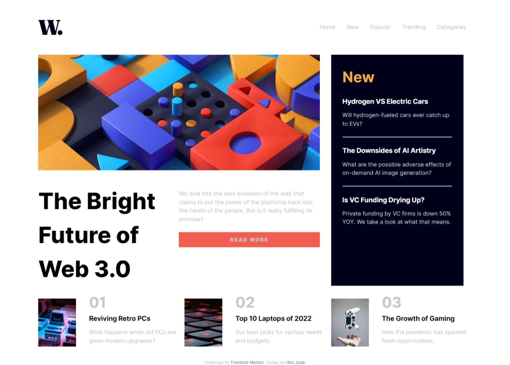
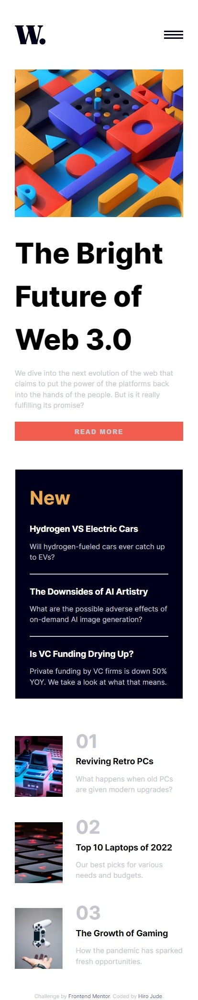

# Frontend Mentor - News homepage solution

This is a solution to the [News homepage challenge on Frontend Mentor](https://www.frontendmentor.io/challenges/news-homepage-H6SWTa1MFl). Frontend Mentor challenges help you improve your coding skills by building realistic projects. 

## Table of contents

- [Overview](#overview)
  - [The challenge](#the-challenge)
  - [Screenshot](#screenshot)
  - [Links](#links)
- [My process](#my-process)
  - [Built with](#built-with)
  - [What I learned](#what-i-learned)
  - [Continued development](#continued-development)
  - [Useful resources](#useful-resources)
- [Author](#author)
- [Acknowledgments](#acknowledgments)


## Overview

### The challenge

Users should be able to:

- View the optimal layout for the interface depending on their device's screen size
- See hover and focus states for all interactive elements on the page
- **Bonus**: Toggle the mobile menu (requires some JavaScript)

### Screenshot





### Links

- Solution URL: [Add solution URL here](https://your-solution-url.com)
- Live Site URL: [Add live site URL here](https://your-live-site-url.com)

## My process

### Built with

- Semantic HTML5 markup
- CSS custom properties
- Flexbox
- CSS Grid
- Mobile-first workflow
- vs_code

### What I learned

Use this section to recap over some of your major learnings while working through this project. Writing these out and providing code samples of areas you want to highlight is a great way to reinforce your own knowledge.

To see how you can add code snippets, see below:

```html
<h1>Some HTML code I'm proud of</h1>
```
```css
.proud-of-this-css {
  color: papayawhip;
}
```
```js
const proudOfThisFunc = () => {
  console.log('🎉')
}
```

If you want more help with writing markdown, we'd recommend checking out [The Markdown Guide](https://www.markdownguide.org/) to learn more.

**Note: Delete this note and the content within this section and replace with your own learnings.**

### Continued development

css grid:
  was one of my most helpful tools;
  would continue to refinen my knowledge on it to make grid positioning more professional

position:
  very important tool, alittle confusing on my side especially with the 'relative and absolute' positionings
  would give more attention to it

javascript:
  not entirely good with it but would work harder

### Useful resources

- [w3 school](https://www.w3schools.com/) - This helped me alot . I really liked how you can get a quick revision of something you might have forgotten and with their simple-practical examples, would definitely use it going forward.
- [Envato tut+](https://tutsplus.com/) - learnt alot of concept from them.


## Author

- Website - [Jude Narh](https://www.your-site.com)
- Frontend Mentor - [@hirojude](https://www.frontendmentor.io/profile/hirojude)
- linkedin - [@jude narh](https://www.linkedin.com/in/jude-narh-59a96b248/)


